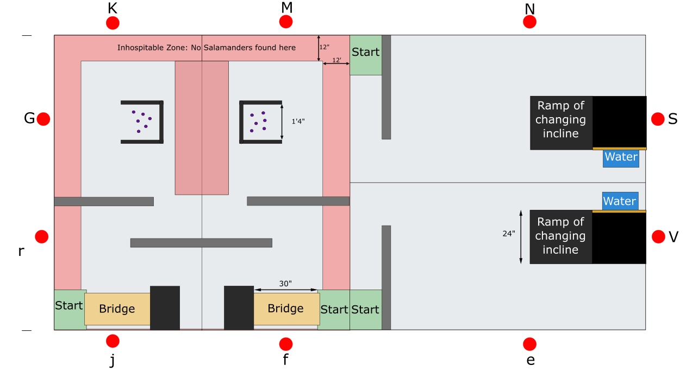
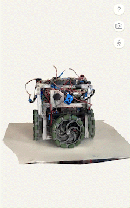
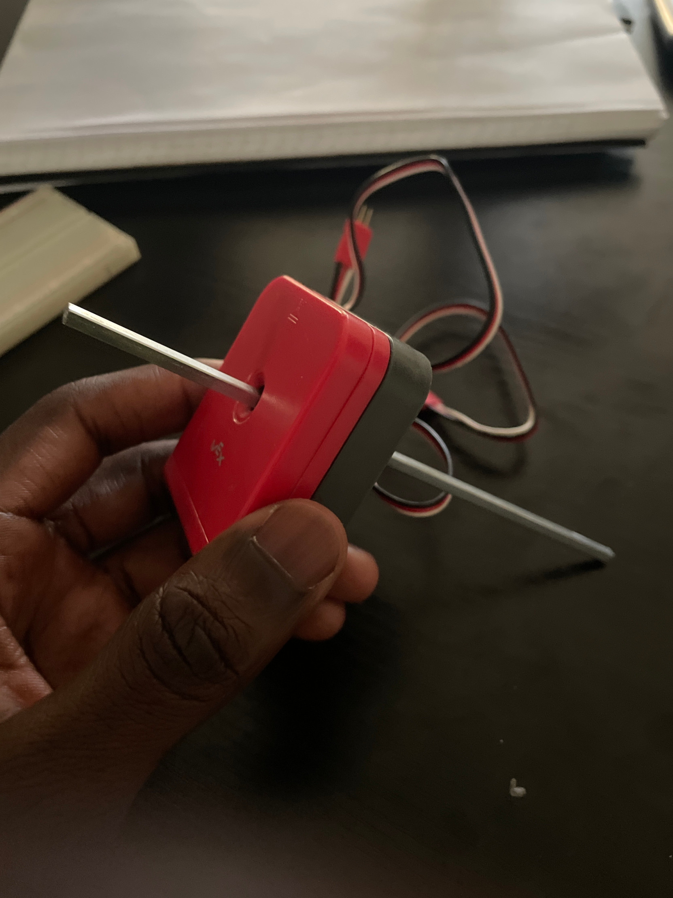
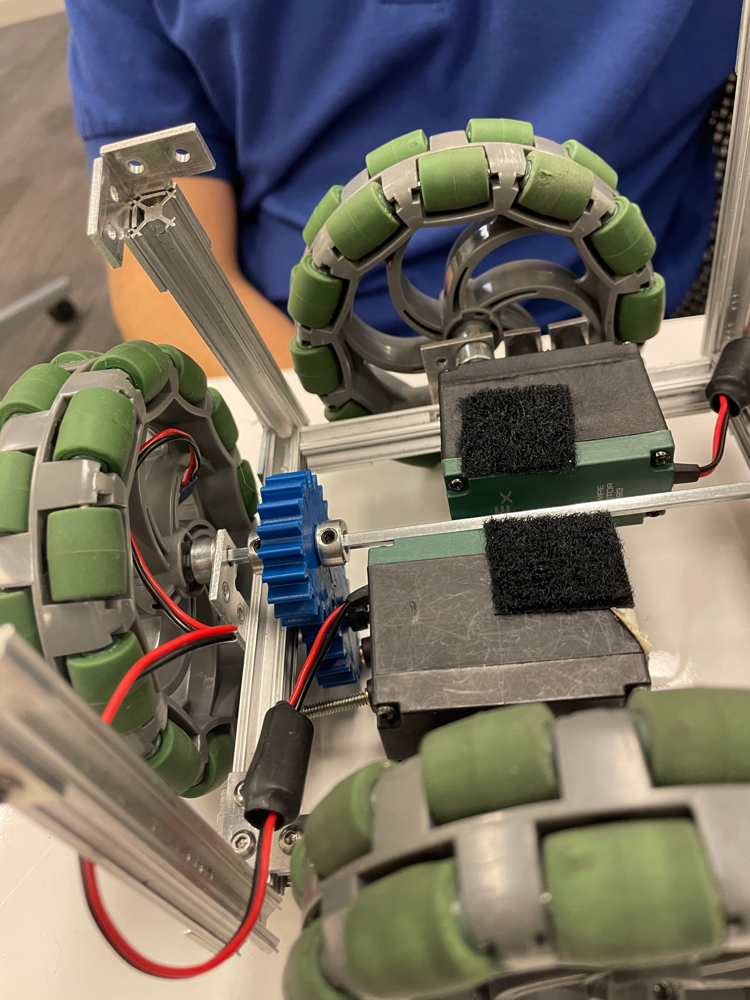
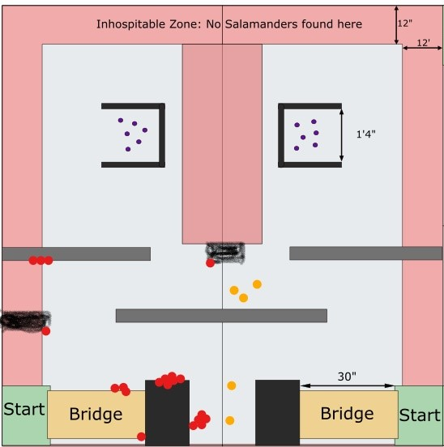

# The Challenge 🎯

My team was tasked with building a robot that performed two sets of tasks,
over the course of two rounds.

✅ = Tasks completed <br>
❌ = Tasks not attempted

| Round 1                | Round 2                                  |
| ---------------------- | ---------------------------------------- |
| - ✅ Cross a bridge    | - ✅ Follow a wall                      |
| - ✅ Navigate a maze   | - ❌ Climb up a ramp                    |
| - ❌ Locate salamanders| - ❌ Measure the salinity of a solution |

Round 1 - Maze navigation - occurred on the two quadrants on the left;
whereas Round 2 - Salinity - occured on the remaining two quadrants
on the right.



# Team Members 👨‍🔬👨‍🔬👨‍🔬👨‍🔬👨‍🔬👨‍🔬

Here are the members of my team followed by the roles:

- Odran Fitzgerald (Bridge and soldering)
- Georges Li (Building)
- Andrew Pan (CAD)
- Nicolas Morin (Wiring and Building)
- Noah Alban (Building)
- Kassi Bertrand 👻 (Software design and implementation)

# Techonologies, Tools, Framework used (optional) 🛠️

- Arduino
- KNWRobot (a library made available to us by SMU staff)

# Results

The following 3D scan showcases the robot the team built 👇🏿.



# Complications 🥵

##  The "Going Straight" Problem

In my opinion, the first problem I encountered was the motors of the robot so it goes straight. I spent significant amounts of time guessing and checking hoping to find the right set of values for motors. It did not work.

### Encoders  

The first serious attempt at solving the problem was to use **_encoders_**, like the one below 👇🏿:



We tried to use them to create P.I.D. control loop
to dynamically adjust the speed of our motors.
Unfortunately, encoders were "too big" in a sense
that fitting four of them on the robot will make it go over
the 20cm x 20cm x 20 cm size requirement my team was aiming
for.

### Solid Axle

The second idea was to use **_solid axle_** for the wheels. The arrangement looked liked
this 👇🏿:



Though using the encoders failed, the idea forced 
my team to come up with a new arrangement for the 
DC Motors. Instead of having four independent motors, we 
used a single axle, controlled by one DC motor, to control 
two wheels at the same time. 
The rationale was that such arrangement
would reduce guarantee that the wheels attached to the solid axle have the same RPM.

The idea was conceptually interesting, but failed for two reasons:

- _Uneven weight distribution_: The robot had a tendency to veer in one direction, when moving.

- _Weak DC motors_: The motors needed to turn very fast to turn the gears.

_Note: a lot og guesses and checks went into finding the right dimensions for the gears. That resulted in a lot of "wasted" time_.

### Motor Calibration

With the previous ideas failing, the team had to revert back 
to the original "4-motors" configuration, and calibrate the motors. 
Instead of guessing and checking like before, motor calibration problem was 
handled using the following piece of code:

```cpp
for(int i = 90; i < 115; i++){
    robot -> pcaDC2MotorsTime(2, 108, 4, i, 3000);
}
```
We set a fixed value for the left motor (`ID: 2`), and using a `for` loop, we continously assigned values to the right motor (`ID: 4`), and observed robot deviation after 3 seconds. We realized the robot was
getting straighter. So, we kept the value that matched the previously choosen value.

_Note: Tests were performed at 13.3V_

##  The "Angle" Problem

With the robot going straight, the team started performing tests on
the left side of the maze. Using some of the crash videos we compiled
we were able to create this _crash_ map, representing crashing points
in the videos:



_Note: Red(🟥) dots = Crash <br>_
_Yellow(🟨) dots = Over Limits_ <br><br>
_Notice: The data on the image were not gathered **methodically** during the tests. They are based on the recordings of crashes made during testing._

During tests, I noticed that the robot would sometimes come at angle to a wall,
start sliding away from it, and the robot would think it found an openning...
resulting in a crash. 👇🏿


So, we addressed the problem in software by implementing a function
responsible for maintaining the robot a relatively safe distance from
an obstacle (i.e. wall). The result was fairly satisfactory 👇🏿


# Takeaways ☺️

I am proud of this experience because it is something I have never done before. Here are the few takeaways:

- _It's okay to ask for help_. I understood that there is no shame in asking for help, or not knowing something. The TAs were really helpful and ready to dedicate time for my team and other teams as well. I want to personally thank [Sam Timmins](https://github.com/sltimmins) here for his time, and input when I was stuck.

- _I cannot do everything on your own_. This experience taught me the importance of relying on others. Trust that they will play their part as intended, so I can play mine as well.

# Potential Improvements 🌱

- If I could do this over again, I would build a bigger robot to perform more tasks.

- I would actively devise experiments and gather useful and reliable data on the performance on the robot on both courses of the map (the maze and the salinity side).

- I would have pressured my team so we have more time for testing the robot.